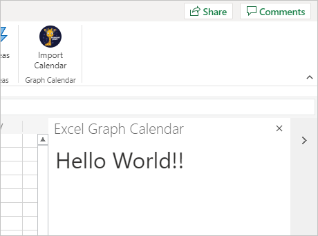

<!-- markdownlint-disable MD002 MD041 -->

En este ejercicio creará una solución de complemento de Office con [Express.](http://expressjs.com/) La solución constará de dos partes.

- El complemento, implementado como archivos HTML y JavaScript estáticos.
- Un Node.js/Express que sirve el complemento e implementa una API web para recuperar datos del complemento.

## <a name="create-the-server"></a>Crear el servidor

1. Abre la interfaz de línea de comandos (CLI), navega a un directorio donde quieras crear el proyecto y ejecuta el siguiente comando para generar una package.jsen el archivo.

    ```Shell
    yarn init
    ```

    Escriba los valores de los mensajes según corresponda. Si no está seguro, los valores predeterminados están bien.

1. Ejecute los siguientes comandos para instalar dependencias.

    ```Shell
    yarn add express@4.17.1 express-promise-router@4.0.1 dotenv@8.2.0 node-fetch@2.6.1 jsonwebtoken@8.5.1@
    yarn add jwks-rsa@1.11.0 @azure/msal-node@1.0.0-beta.1 @microsoft/microsoft-graph-client@2.1.1
    yarn add date-fns@2.16.1 date-fns-tz@1.0.12 isomorphic-fetch@3.0.0 windows-iana@4.2.1
    yarn add -D typescript@4.0.5 ts-node@9.0.0 nodemon@2.0.6 @types/node@14.14.7 @types/express@4.17.9
    yarn add -D @types/node-fetch@2.5.7 @types/jsonwebtoken@8.5.0 @types/microsoft-graph@1.26.0
    yarn add -D @types/office-js@1.0.147 @types/jquery@3.5.4 @types/isomorphic-fetch@0.0.35
    ```

1. Ejecute el siguiente comando para generar una tsconfig.jsen el archivo.

    ```Shell
    tsc --init
    ```

1. Abra **./tsconfig.jsen** un editor de texto y realice los siguientes cambios.

    - Cambie el `target` valor a `es6` .
    - Descomprima `outDir` el valor y esta establece el valor en `./dist` .
    - Descomprima `rootDir` el valor y esta establece el valor en `./src` .

1. Abra **./package.jsy** agregue la siguiente propiedad al JSON.

    ```json
    "scripts": {
      "start": "nodemon ./src/server.ts",
      "build": "tsc --project ./"
    },
    ```

1. Ejecute el siguiente comando para generar e instalar certificados de desarrollo para el complemento.

    ```Shell
    npx office-addin-dev-certs install
    ```

    Si se le solicita confirmación, confirme las acciones. Una vez completado el comando, verá un resultado similar al siguiente.

    ```Shell
    You now have trusted access to https://localhost.
    Certificate: <path>\localhost.crt
    Key: <path>\localhost.key
    ```

1. Cree un archivo denominado **.env** en la raíz del proyecto y agregue el siguiente código.

    :::code language="ini" source="../demo/graph-tutorial/example.env":::

    Reemplace con la ruta de acceso a localhost.crt y con la ruta de acceso a `PATH_TO_LOCALHOST.CRT` `PATH_TO_LOCALHOST.KEY` la salida localhost.key por el comando anterior.

1. Cree un directorio en la raíz del proyecto denominado **src**.

1. Cree dos directorios en el **directorio ./src:** **addin** y **api.**

1. Cree un archivo denominado **auth.ts** en el directorio **./src/api** y agregue el siguiente código.

    ```typescript
    import Router from 'express-promise-router';

    const authRouter = Router();

    // TODO: Implement this router

    export default authRouter;
    ```

1. Cree un archivo denominado **graph.ts** en el directorio **./src/api** y agregue el siguiente código.

    ```typescript
    import Router from 'express-promise-router';

    const graphRouter = Router();

    // TODO: Implement this router

    export default graphRouter;
    ```

1. Cree un archivo denominado **server.ts** en el directorio **./src** y agregue el siguiente código.

    :::code language="typescript" source="../demo/graph-tutorial/src/server.ts" id="ServerSnippet":::

## <a name="create-the-add-in"></a>Crear el complemento

1. Cree un archivo denominado **taskpane.html** en el directorio **./src/addin** y agregue el siguiente código.

    :::code language="html" source="../demo/graph-tutorial/src/addin/taskpane.html" id="TaskPaneHtmlSnippet":::

1. Cree un archivo denominado **taskpane.css** en el directorio **./src/addin** y agregue el siguiente código.

    :::code language="css" source="../demo/graph-tutorial/src/addin/taskpane.css":::

1. Cree un archivo denominado **taskpane.js** en el directorio **./src/addin** y agregue el siguiente código.

    ```javascript
    // TEMPORARY CODE TO VERIFY ADD-IN LOADS
    'use strict';

    Office.onReady(info => {
      if (info.host === Office.HostType.Excel) {
        $(function() {
          $('p').text('Hello World!!');
        });
      }
    });
    ```

1. Cree un nuevo directorio en el directorio **.src/addin** denominado **assets**.

1. Agregue tres archivos PNG en este directorio de acuerdo con la tabla siguiente.

    | Nombre de archivo   | Tamaño en píxeles |
    |-------------|----------------|
    | icon-80.png | 80x80          |
    | icon-32.png | 32x32          |
    | icon-16.png | 16x16          |

    > [!NOTE]
    > Puede usar cualquier imagen que desee para este paso. También puede descargar las imágenes usadas en este ejemplo directamente desde [GitHub.](https://github.com/microsoftgraph/msgraph-training-office-addin/demo/graph-tutorial/src/addin/assets)

1. Cree un nuevo directorio en la raíz del manifiesto con nombre del **proyecto.**

1. Cree un archivo denominado **manifest.xml** en la carpeta **./manifest** y agregue el siguiente código. Reemplazar `NEW_GUID_HERE` con un nuevo GUID, como `b4fa03b8-1eb6-4e8b-a380-e0476be9e019` .

    :::code language="xml" source="../demo/graph-tutorial/manifest/manifest.xml":::

## <a name="side-load-the-add-in-in-excel"></a>Carga lateral del complemento en Excel

1. Inicie el servidor ejecutando el siguiente comando.

    ```Shell
    yarn start
    ```

1. Abra el explorador y vaya a `https://localhost:3000/taskpane.html` . Debería ver un `Not loaded` mensaje.

1. En el explorador, vaya a [Office.com](https://www.office.com/) e inicie sesión. Seleccione **Crear en la** barra de herramientas izquierda y, a continuación, seleccione Hoja de **cálculo.**

    

1. Seleccione la **pestaña** Insertar y, a continuación, **seleccione Complementos de Office.**

1. Seleccione **Cargar mi complemento y,** a continuación, seleccione **Examinar.** Cargue el **archivo ./manifest/manifest.xml.**

1. Seleccione el **botón Importar calendario** en la pestaña **Inicio** para abrir el panel de tareas.

    

1. Después de abrir el panel de tareas, debería ver un `Hello World!` mensaje.

    
