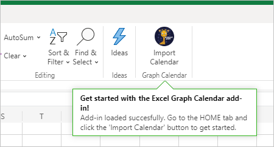

<!-- markdownlint-disable MD002 MD041 -->

<span data-ttu-id="35891-101">En este ejercicio creará una solución de complemento de Office con [Express.](http://expressjs.com/)</span><span class="sxs-lookup"><span data-stu-id="35891-101">In this exercise you will create an Office Add-in solution using [Express](http://expressjs.com/).</span></span> <span data-ttu-id="35891-102">La solución constará de dos partes.</span><span class="sxs-lookup"><span data-stu-id="35891-102">The solution will consist of two parts.</span></span>

- <span data-ttu-id="35891-103">El complemento, implementado como archivos HTML y JavaScript estáticos.</span><span class="sxs-lookup"><span data-stu-id="35891-103">The add-in, implemented as static HTML and JavaScript files.</span></span>
- <span data-ttu-id="35891-104">Un Node.js/Express que sirve el complemento e implementa una API web para recuperar datos del complemento.</span><span class="sxs-lookup"><span data-stu-id="35891-104">A Node.js/Express server that serves the add-in and implements a web API to retrieve data for the add-in.</span></span>

## <a name="create-the-server"></a><span data-ttu-id="35891-105">Crear el servidor</span><span class="sxs-lookup"><span data-stu-id="35891-105">Create the server</span></span>

1. <span data-ttu-id="35891-106">Abre la interfaz de línea de comandos (CLI), navega a un directorio donde quieras crear el proyecto y ejecuta el siguiente comando para generar una package.jsen el archivo.</span><span class="sxs-lookup"><span data-stu-id="35891-106">Open your command-line interface (CLI), navigate to a directory where you want to create your project, and run the following command to generate a package.json file.</span></span>

    ```Shell
    yarn init
    ```

    <span data-ttu-id="35891-107">Escriba los valores de los mensajes según corresponda.</span><span class="sxs-lookup"><span data-stu-id="35891-107">Enter values for the prompts as appropriate.</span></span> <span data-ttu-id="35891-108">Si no está seguro, los valores predeterminados están bien.</span><span class="sxs-lookup"><span data-stu-id="35891-108">If you're unsure, the default values are fine.</span></span>

1. <span data-ttu-id="35891-109">Ejecute los siguientes comandos para instalar dependencias.</span><span class="sxs-lookup"><span data-stu-id="35891-109">Run the following commands to install dependencies.</span></span>

    ```Shell
    yarn add express@4.17.1 express-promise-router@4.0.1 dotenv@8.2.0 node-fetch@2.6.1 jsonwebtoken@8.5.1@
    yarn add jwks-rsa@1.11.0 @azure/msal-node@1.0.0-beta.1 @microsoft/microsoft-graph-client@2.1.1
    yarn add date-fns@2.16.1 date-fns-tz@1.0.12 isomorphic-fetch@3.0.0 windows-iana@4.2.1
    yarn add -D typescript@4.0.5 ts-node@9.0.0 nodemon@2.0.6 @types/node@14.14.7 @types/express@4.17.9
    yarn add -D @types/node-fetch@2.5.7 @types/jsonwebtoken@8.5.0 @types/microsoft-graph@1.26.0
    yarn add -D @types/office-js@1.0.147 @types/jquery@3.5.4 @types/isomorphic-fetch@0.0.35
    ```

1. <span data-ttu-id="35891-110">Ejecute el siguiente comando para generar una tsconfig.jsen el archivo.</span><span class="sxs-lookup"><span data-stu-id="35891-110">Run the following command to generate a tsconfig.json file.</span></span>

    ```Shell
    tsc --init
    ```

1. <span data-ttu-id="35891-111">Abra **./tsconfig.jsen** un editor de texto y realice los siguientes cambios.</span><span class="sxs-lookup"><span data-stu-id="35891-111">Open **./tsconfig.json** in a text editor and make the following changes.</span></span>

    - <span data-ttu-id="35891-112">Cambie el `target` valor a `es6` .</span><span class="sxs-lookup"><span data-stu-id="35891-112">Change the `target` value to `es6`.</span></span>
    - <span data-ttu-id="35891-113">Descomprima `outDir` el valor y esta establece el valor en `./dist` .</span><span class="sxs-lookup"><span data-stu-id="35891-113">Uncomment the `outDir` value and set it to `./dist`.</span></span>
    - <span data-ttu-id="35891-114">Descomprima `rootDir` el valor y esta establece el valor en `./src` .</span><span class="sxs-lookup"><span data-stu-id="35891-114">Uncomment the `rootDir` value and set it to `./src`.</span></span>

1. <span data-ttu-id="35891-115">Abra **./package.jsy** agregue la siguiente propiedad al JSON.</span><span class="sxs-lookup"><span data-stu-id="35891-115">Open **./package.json** and add the following property to the JSON.</span></span>

    ```json
    "scripts": {
      "start": "nodemon ./src/server.ts",
      "build": "tsc --project ./"
    },
    ```

1. <span data-ttu-id="35891-116">Ejecute el siguiente comando para generar e instalar certificados de desarrollo para el complemento.</span><span class="sxs-lookup"><span data-stu-id="35891-116">Run the following command to generate and install development certificates for your add-in.</span></span>

    ```Shell
    npx office-addin-dev-certs install
    ```

    <span data-ttu-id="35891-117">Si se le solicita confirmación, confirme las acciones.</span><span class="sxs-lookup"><span data-stu-id="35891-117">If prompted for confirmation, confirm the actions.</span></span> <span data-ttu-id="35891-118">Una vez completado el comando, verá un resultado similar al siguiente.</span><span class="sxs-lookup"><span data-stu-id="35891-118">Once the command completes, you will see output similar to the following.</span></span>

    ```Shell
    You now have trusted access to https://localhost.
    Certificate: <path>\localhost.crt
    Key: <path>\localhost.key
    ```

1. <span data-ttu-id="35891-119">Cree un archivo denominado **.env** en la raíz del proyecto y agregue el siguiente código.</span><span class="sxs-lookup"><span data-stu-id="35891-119">Create a new file named **.env** in the root of your project and add the following code.</span></span>

    :::code language="ini" source="../demo/graph-tutorial/example.env":::

    <span data-ttu-id="35891-120">Reemplace con la ruta de acceso a localhost.crt y con la ruta de acceso a `PATH_TO_LOCALHOST.CRT` `PATH_TO_LOCALHOST.KEY` la salida localhost.key por el comando anterior.</span><span class="sxs-lookup"><span data-stu-id="35891-120">Replace `PATH_TO_LOCALHOST.CRT` with the path to localhost.crt and `PATH_TO_LOCALHOST.KEY` with the path to localhost.key output by the previous command.</span></span>

1. <span data-ttu-id="35891-121">Cree un directorio en la raíz del proyecto denominado **src**.</span><span class="sxs-lookup"><span data-stu-id="35891-121">Create a new directory in the root of your project named **src**.</span></span>

1. <span data-ttu-id="35891-122">Cree dos directorios en el **directorio ./src:** **addin** y **api.**</span><span class="sxs-lookup"><span data-stu-id="35891-122">Create two directories in the **./src** directory: **addin** and **api**.</span></span>

1. <span data-ttu-id="35891-123">Cree un archivo denominado **auth.ts** en el directorio **./src/api** y agregue el siguiente código.</span><span class="sxs-lookup"><span data-stu-id="35891-123">Create a new file named **auth.ts** in the **./src/api** directory and add the following code.</span></span>

    ```typescript
    import Router from 'express-promise-router';

    const authRouter = Router();

    // TODO: Implement this router

    export default authRouter;
    ```

1. <span data-ttu-id="35891-124">Cree un archivo denominado **graph.ts** en el directorio **./src/api** y agregue el siguiente código.</span><span class="sxs-lookup"><span data-stu-id="35891-124">Create a new file named **graph.ts** in the **./src/api** directory and add the following code.</span></span>

    ```typescript
    import Router from 'express-promise-router';

    const graphRouter = Router();

    // TODO: Implement this router

    export default graphRouter;
    ```

1. <span data-ttu-id="35891-125">Cree un archivo denominado **server.ts** en el directorio **./src** y agregue el siguiente código.</span><span class="sxs-lookup"><span data-stu-id="35891-125">Create a new file named **server.ts** in the **./src** directory and add the following code.</span></span>

    :::code language="typescript" source="../demo/graph-tutorial/src/server.ts" id="ServerSnippet":::

## <a name="create-the-add-in"></a><span data-ttu-id="35891-126">Crear el complemento</span><span class="sxs-lookup"><span data-stu-id="35891-126">Create the add-in</span></span>

1. <span data-ttu-id="35891-127">Cree un archivo denominado **taskpane.html** en el directorio **./src/addin** y agregue el siguiente código.</span><span class="sxs-lookup"><span data-stu-id="35891-127">Create a new file named **taskpane.html** in the **./src/addin** directory and add the following code.</span></span>

    :::code language="html" source="../demo/graph-tutorial/src/addin/taskpane.html" id="TaskPaneHtmlSnippet":::

1. <span data-ttu-id="35891-128">Cree un archivo denominado **taskpane.css** en el directorio **./src/addin** y agregue el siguiente código.</span><span class="sxs-lookup"><span data-stu-id="35891-128">Create a new file named **taskpane.css** in the **./src/addin** directory and add the following code.</span></span>

    :::code language="css" source="../demo/graph-tutorial/src/addin/taskpane.css":::

1. <span data-ttu-id="35891-129">Cree un archivo denominado **taskpane.js** en el directorio **./src/addin** y agregue el siguiente código.</span><span class="sxs-lookup"><span data-stu-id="35891-129">Create a new file named **taskpane.js** in the **./src/addin** directory and add the following code.</span></span>

    ```javascript
    // TEMPORARY CODE TO VERIFY ADD-IN LOADS
    'use strict';

    Office.onReady(info => {
      if (info.host === Office.HostType.Excel) {
        $(function() {
          $('p').text('Hello World!!');
        });
      }
    });
    ```

1. <span data-ttu-id="35891-130">Cree un nuevo directorio en el directorio **.src/addin** denominado **assets**.</span><span class="sxs-lookup"><span data-stu-id="35891-130">Create a new directory in the **.src/addin** directory named **assets**.</span></span>

1. <span data-ttu-id="35891-131">Agregue tres archivos PNG en este directorio de acuerdo con la tabla siguiente.</span><span class="sxs-lookup"><span data-stu-id="35891-131">Add three PNG files in this directory according to the following table.</span></span>

    | <span data-ttu-id="35891-132">Nombre de archivo</span><span class="sxs-lookup"><span data-stu-id="35891-132">File name</span></span>   | <span data-ttu-id="35891-133">Tamaño en píxeles</span><span class="sxs-lookup"><span data-stu-id="35891-133">Size in pixels</span></span> |
    |-------------|----------------|
    | <span data-ttu-id="35891-134">icon-80.png</span><span class="sxs-lookup"><span data-stu-id="35891-134">icon-80.png</span></span> | <span data-ttu-id="35891-135">80x80</span><span class="sxs-lookup"><span data-stu-id="35891-135">80x80</span></span>          |
    | <span data-ttu-id="35891-136">icon-32.png</span><span class="sxs-lookup"><span data-stu-id="35891-136">icon-32.png</span></span> | <span data-ttu-id="35891-137">32x32</span><span class="sxs-lookup"><span data-stu-id="35891-137">32x32</span></span>          |
    | <span data-ttu-id="35891-138">icon-16.png</span><span class="sxs-lookup"><span data-stu-id="35891-138">icon-16.png</span></span> | <span data-ttu-id="35891-139">16x16</span><span class="sxs-lookup"><span data-stu-id="35891-139">16x16</span></span>          |

    > [!NOTE]
    > <span data-ttu-id="35891-140">Puede usar cualquier imagen que desee para este paso.</span><span class="sxs-lookup"><span data-stu-id="35891-140">You can use any image you want for this step.</span></span> <span data-ttu-id="35891-141">También puede descargar las imágenes usadas en este ejemplo directamente desde [GitHub.](https://github.com/microsoftgraph/msgraph-training-office-addin/demo/graph-tutorial/src/addin/assets)</span><span class="sxs-lookup"><span data-stu-id="35891-141">You can also download the images used in this sample directly from [GitHub](https://github.com/microsoftgraph/msgraph-training-office-addin/demo/graph-tutorial/src/addin/assets).</span></span>

1. <span data-ttu-id="35891-142">Cree un nuevo directorio en la raíz del manifiesto con nombre del **proyecto.**</span><span class="sxs-lookup"><span data-stu-id="35891-142">Create a new directory in the root of the project named **manifest**.</span></span>

1. <span data-ttu-id="35891-143">Cree un archivo denominado **manifest.xml** en la carpeta **./manifest** y agregue el siguiente código.</span><span class="sxs-lookup"><span data-stu-id="35891-143">Create a new file named **manifest.xml** in the **./manifest** folder and add the following code.</span></span> <span data-ttu-id="35891-144">Reemplazar `NEW_GUID_HERE` con un nuevo GUID, como `b4fa03b8-1eb6-4e8b-a380-e0476be9e019` .</span><span class="sxs-lookup"><span data-stu-id="35891-144">Replace `NEW_GUID_HERE` with a new GUID, like `b4fa03b8-1eb6-4e8b-a380-e0476be9e019`.</span></span>

    :::code language="xml" source="../demo/graph-tutorial/manifest/manifest.xml":::

## <a name="side-load-the-add-in-in-excel"></a><span data-ttu-id="35891-145">Carga lateral del complemento en Excel</span><span class="sxs-lookup"><span data-stu-id="35891-145">Side-load the add-in in Excel</span></span>

1. <span data-ttu-id="35891-146">Inicie el servidor ejecutando el siguiente comando.</span><span class="sxs-lookup"><span data-stu-id="35891-146">Start the server by running the following command.</span></span>

    ```Shell
    yarn start
    ```

1. <span data-ttu-id="35891-147">Abra el explorador y vaya a `https://localhost:3000/taskpane.html` .</span><span class="sxs-lookup"><span data-stu-id="35891-147">Open your browser and browse to `https://localhost:3000/taskpane.html`.</span></span> <span data-ttu-id="35891-148">Debería ver un `Not loaded` mensaje.</span><span class="sxs-lookup"><span data-stu-id="35891-148">You should see a `Not loaded` message.</span></span>

1. <span data-ttu-id="35891-149">En el explorador, vaya a [Office.com](https://www.office.com/) e inicie sesión.</span><span class="sxs-lookup"><span data-stu-id="35891-149">In your browser, go to [Office.com](https://www.office.com/) and sign in.</span></span> <span data-ttu-id="35891-150">Seleccione **Crear en la** barra de herramientas izquierda y, a continuación, seleccione Hoja de **cálculo.**</span><span class="sxs-lookup"><span data-stu-id="35891-150">Select **Create** in the left-hand toolbar, then select **Spreadsheet**.</span></span>

    

1. <span data-ttu-id="35891-152">Seleccione la **pestaña** Insertar y, a continuación, **seleccione Complementos de Office.**</span><span class="sxs-lookup"><span data-stu-id="35891-152">Select the **Insert** tab, then select **Office Add-ins**.</span></span>

1. <span data-ttu-id="35891-153">Seleccione **Cargar mi complemento y,** a continuación, seleccione **Examinar.**</span><span class="sxs-lookup"><span data-stu-id="35891-153">Select **Upload My Add-in**, then select **Browse**.</span></span> <span data-ttu-id="35891-154">Cargue el **archivo ./manifest/manifest.xml.**</span><span class="sxs-lookup"><span data-stu-id="35891-154">Upload your **./manifest/manifest.xml** file.</span></span>

1. <span data-ttu-id="35891-155">Seleccione el **botón Importar calendario** en la pestaña **Inicio** para abrir el panel de tareas.</span><span class="sxs-lookup"><span data-stu-id="35891-155">Select the **Import Calendar** button on the **Home** tab to open the taskpane.</span></span>

    

1. <span data-ttu-id="35891-157">Después de abrir el panel de tareas, debería ver un `Hello World!` mensaje.</span><span class="sxs-lookup"><span data-stu-id="35891-157">After the taskpane opens, you should see a `Hello World!` message.</span></span>

    
