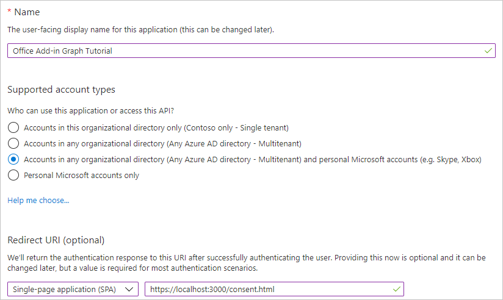
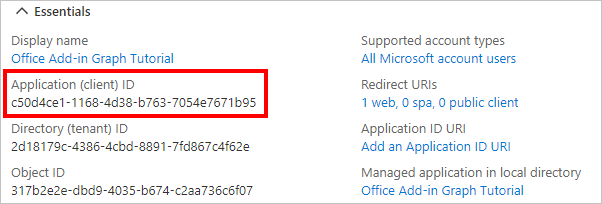

<!-- markdownlint-disable MD002 MD041 -->

En este ejercicio, creará un nuevo registro de aplicación web de Azure AD mediante el Centro de administración de Azure Active Directory.In this exercise, you will create a new Azure AD web application registration using the Azure Active Directory admin center.

1. Abra un explorador y vaya al [centro de administración de Azure Active Directory](https://aad.portal.azure.com).Open a browser and navigate to the [Azure Active Directory admin center](https://aad.portal.azure.com). Inicie sesión con una **cuenta personal** (también conocida como: cuenta Microsoft) o una **cuenta profesional o educativa**.Login using a **personal account** (aka: Microsoft Account) or **Work or School Account**.

1. Seleccione **Azure Active Directory** en el panel de navegación izquierdo y, a continuación, seleccione **Registros de aplicaciones** en **Administrar**.Select **Azure Active Directory** in the left-hand navigation, then select **App registrations** under **Manage**.

    

1. Seleccione **Nuevo registro**.Select **New registration**. En la página **Registrar una aplicación**, establezca los valores siguientes.On the **Register an application** page, set the values as follows.

    - Establezca **Nombre** como `Office Add-in Graph Tutorial`.Set **Name** to `Office Add-in Graph Tutorial`.
    - Establezca **Tipos de cuenta admitidos** en **Cuentas en cualquier directorio de organización y cuentas personales de Microsoft**.Set **Supported account types** to **Accounts in any organizational directory and personal Microsoft accounts**.
    - En **URI de redirección**, establezca la primera lista desplegable en `Single-page application (SPA)` y establezca el valor `https://localhost:3000/consent.html`.Under **Redirect URI**, set the first drop-down to `Single-page application (SPA)` and set the value to `https://localhost:3000/consent.html`.

    

1. Seleccione **Registrar**.Select **Register**. En la **página Tutorial de Office Add-in Graph,** copie el valor del id. de aplicación **(cliente)** y guárdelo, lo necesitará en el paso siguiente.On the **Office Add-in Graph Tutorial** page, copy the value of the **Application (client) ID** and save it, you will need it in the next step.

    

1. Seleccione **Certificados y secretos** en **Administrar**.Select **Certificates & secrets** under **Manage**. Seleccione el botón **Nuevo secreto de cliente**.Select the **New client secret** button. Escriba un valor en **Descripción,** seleccione una de las opciones para **Expira y** seleccione **Agregar**.Enter a value in **Description** and select one of the options for **Expires** and select **Add**.

1. Copie el valor del secreto de cliente antes de salir de esta página.Copy the client secret value before you leave this page. Lo necesitará en el siguiente paso.You will need it in the next step.

    > [!IMPORTANT]
    > El secreto de cliente no se vuelve a mostrar, así que asegúrese de copiarlo en este momento.This client secret is never shown again, so make sure you copy it now.

1. Seleccione **permisos de API en** **Administrar** y, a continuación, seleccione Agregar **un permiso.**Select **API permissions** under **Manage**, then select **Add a permission**.

1. Seleccione **Microsoft Graph** y, a continuación, permisos **delegados.**Select **Microsoft Graph**, then **Delegated permissions**.

1. Seleccione los permisos siguientes y, a **continuación, seleccione Agregar permisos.**Select the following permissions, then select **Add permissions**.

    - **offline_access:** esto permitirá que la aplicación actualice los tokens de acceso cuando expiren.**offline_access** - this will allow the app to refresh access tokens when they expire.
    - **Calendars.ReadWrite:** esto permitirá que la aplicación lea y escriba en el calendario del usuario.**Calendars.ReadWrite** - this will allow the app to read and write to the user's calendar.
    - **MailboxSettings.Read:** esto permitirá que la aplicación obtenga la zona horaria del usuario desde su configuración de buzón.**MailboxSettings.Read** - this will allow the app to get the user's time zone from their mailbox settings.

    

## Configurar el inicio de sesión único del complemento de OfficeConfigure Office Add-in single sign-on

En esta sección, actualizará el registro de la aplicación para admitir el inicio de sesión único [(SSO)](https://docs.microsoft.com/office/dev/add-ins/develop/sso-in-office-add-ins)del complemento de Office.In this section you'll update the app registration to support [Office Add-in single sign-on (SSO)](https://docs.microsoft.com/office/dev/add-ins/develop/sso-in-office-add-ins).

1. Seleccione **Exponer una API.**Select **Expose an API**. En la **sección Ámbitos definidos por esta API,** seleccione **Agregar un ámbito.**In the **Scopes defined by this API** section, select **Add a scope**. Cuando se le pida que establezca un **URI de id.** de aplicación, establezca el valor en `api://localhost:3000/YOUR_APP_ID_HERE` , reemplazando con el identificador de `YOUR_APP_ID_HERE` aplicación.When prompted to set an **Application ID URI**, set the value to `api://localhost:3000/YOUR_APP_ID_HERE`, replacing `YOUR_APP_ID_HERE` with the application ID. Elija **Guardar y continuar.**Choose **Save and continue**.

1. Rellene los campos como se muestra a continuación y seleccione **Agregar ámbito.**Fill in the fields as follows and select **Add scope**.

    - **Nombre del ámbito:**`access_as_user`**Scope name:** `access_as_user`
    - **¿Quién puede dar su consentimiento?: Administradores y usuarios****Who can consent?: Admins and users**
    - **Nombre para mostrar del consentimiento del administrador:**`Access the app as the user`**Admin consent display name:** `Access the app as the user`
    - **Descripción del consentimiento del administrador:**`Allows Office Add-ins to call the app's web APIs as the current user.`**Admin consent description:** `Allows Office Add-ins to call the app's web APIs as the current user.`
    - **Nombre para mostrar del consentimiento del usuario:**`Access the app as you`**User consent display name:** `Access the app as you`
    - **Descripción del consentimiento del usuario:**`Allows Office Add-ins to call the app's web APIs as you.`**User consent description:** `Allows Office Add-ins to call the app's web APIs as you.`
    - **Estado: habilitado****State: Enabled**

    

1. En la **sección Aplicaciones cliente autorizadas,** seleccione Agregar una **aplicación cliente.**In the **Authorized client applications** section, select **Add a client application**. Escriba un identificador de cliente en la siguiente lista, habilite el ámbito en **Ámbitos autorizados** y seleccione **Agregar aplicación.**Enter a client ID from the following list, enable the scope under **Authorized scopes**, and select **Add application**. Repita este proceso para cada uno de los IDs de cliente de la lista.Repeat this process for each of the client IDs in the list.

    - `d3590ed6-52b3-4102-aeff-aad2292ab01c` (Microsoft Office)`d3590ed6-52b3-4102-aeff-aad2292ab01c` (Microsoft Office)
    - `ea5a67f6-b6f3-4338-b240-c655ddc3cc8e` (Microsoft Office)`ea5a67f6-b6f3-4338-b240-c655ddc3cc8e` (Microsoft Office)
    - `57fb890c-0dab-4253-a5e0-7188c88b2bb4` (Office en la Web)`57fb890c-0dab-4253-a5e0-7188c88b2bb4` (Office on the web)
    - `08e18876-6177-487e-b8b5-cf950c1e598c` (Office en la Web)`08e18876-6177-487e-b8b5-cf950c1e598c` (Office on the web)
