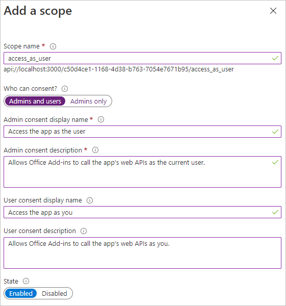

<!-- markdownlint-disable MD002 MD041 -->

En este ejercicio, creará un nuevo registro de aplicaciones web de Azure AD mediante el Centro de administración de Azure Active Directory.

1. Abra un explorador y vaya al [centro de administración de Azure Active Directory](https://aad.portal.azure.com). Inicie sesión con una **cuenta personal** (también conocida como: cuenta Microsoft) o una **cuenta profesional o educativa**.

1. Seleccione **Azure Active Directory** en el panel de navegación izquierdo y, a continuación, seleccione **Registros de aplicaciones** en **Administrar**.

    

1. Seleccione **Nuevo registro**. En la página **Registrar una aplicación**, establezca los valores siguientes.

    - Establezca **Nombre** como `Office Add-in Graph Tutorial`.
    - Establezca **Tipos de cuenta admitidos** en **Cuentas en cualquier directorio de organización y cuentas personales de Microsoft**.
    - En **URI de redirección**, establezca la primera lista desplegable en `Single-page application (SPA)` y establezca el valor `https://localhost:3000/consent.html`.

    

1. Seleccione **Registrar**. En la página Tutorial de Gráfico de complementos de **Office,** copie el valor del identificador de aplicación **(cliente)** y guárdelo, lo necesitará en el paso siguiente.

    

1. Seleccione **Autenticación** en **Administrar**. Busque la **sección Concesión** implícita y habilite **los tokens de Access** y los tokens de **id.**. Seleccione **Guardar**.

    

1. Seleccione **Certificados y secretos** en **Administrar**. Seleccione el botón **Nuevo secreto de cliente**. Escriba un valor en **Descripción**, y seleccione una de las opciones para **Expira**, y después, **Agregar**.

1. Copie el valor del secreto de cliente antes de salir de esta página. Lo necesitará en el siguiente paso.

    > [!IMPORTANT]
    > El secreto de cliente no se vuelve a mostrar, así que asegúrese de copiarlo en este momento.

1. Seleccione **Permisos de API en** **Administrar** y, a continuación, seleccione Agregar **un permiso**.

1. Seleccione **Microsoft Graph** y, a continuación, Permisos **delegados**.

1. Seleccione los siguientes permisos y, a continuación, **seleccione Agregar permisos**.

    - **offline_access:** esto permitirá a la aplicación actualizar los tokens de acceso cuando expiren.
    - **Calendars.ReadWrite:** esto permitirá que la aplicación lea y escriba en el calendario del usuario.
    - **MailboxSettings.Read:** esto permitirá a la aplicación obtener la zona horaria del usuario desde la configuración de su buzón.

    

## Configurar el inicio de sesión único del complemento de Office

En esta sección, actualizará el registro de la aplicación para admitir el inicio de sesión único [(SSO)](https://docs.microsoft.com/office/dev/add-ins/develop/sso-in-office-add-ins)del complemento de Office.

1. Seleccione **Exponer una API**. En la **sección Ámbitos definidos por esta API,** seleccione **Agregar un ámbito**. Cuando se le pida que establezca un **URI de id.** de aplicación, establezca el valor en `api://localhost:3000/YOUR_APP_ID_HERE` , reemplazando por el identificador de `YOUR_APP_ID_HERE` aplicación. Elija **Guardar y continuar**.

1. Rellene los campos de la siguiente manera y seleccione **Agregar ámbito**.

    - **Nombre del ámbito:**`access_as_user`
    - **¿Quién puede dar su consentimiento?: Administradores y usuarios**
    - **Nombre para mostrar del consentimiento de administrador:**`Access the app as the user`
    - **Descripción del consentimiento de administrador:**`Allows Office Add-ins to call the app's web APIs as the current user.`
    - **Nombre para mostrar del consentimiento del usuario:**`Access the app as you`
    - **Descripción del consentimiento del usuario:**`Allows Office Add-ins to call the app's web APIs as you.`
    - **Estado: habilitado**

    

1. En la **sección Aplicaciones cliente autorizadas,** seleccione Agregar una **aplicación cliente**. Escriba un identificador de cliente en la siguiente lista, habilite el ámbito en **Ámbitos autorizados** y seleccione **Agregar aplicación**. Repita este proceso para cada uno de los IDs de cliente de la lista.

    - `d3590ed6-52b3-4102-aeff-aad2292ab01c` (Microsoft Office)
    - `ea5a67f6-b6f3-4338-b240-c655ddc3cc8e` (Microsoft Office)
    - `57fb890c-0dab-4253-a5e0-7188c88b2bb4` (Office en la Web)
    - `08e18876-6177-487e-b8b5-cf950c1e598c` (Office en la Web)
